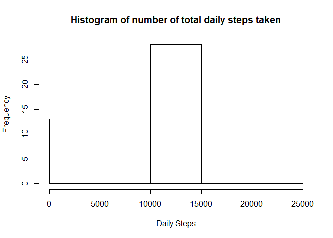
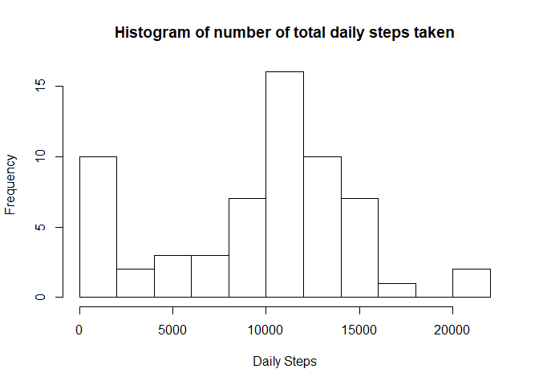
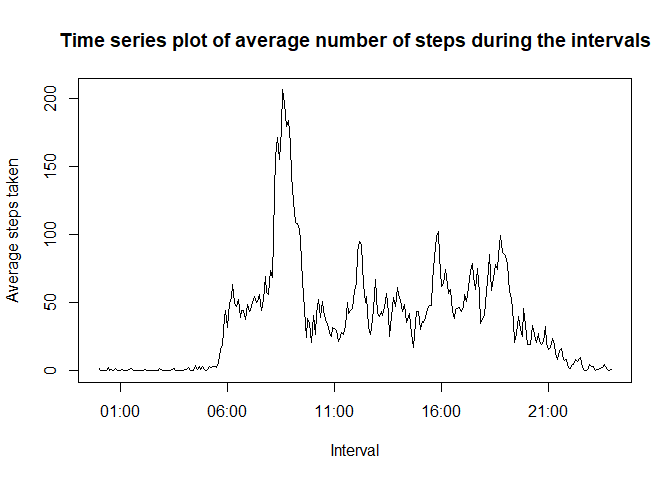
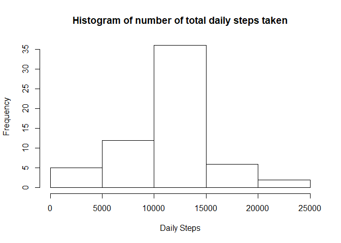
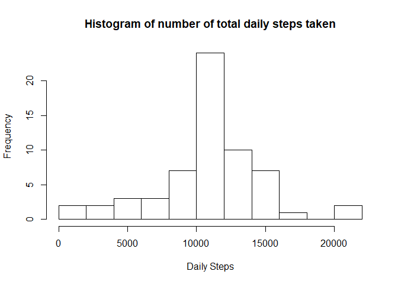
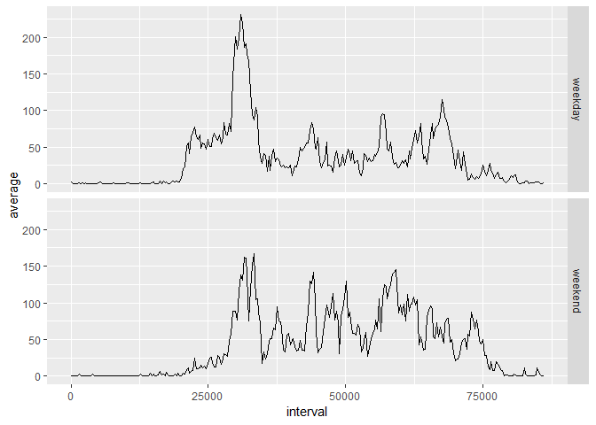

## Loading and preprocessing the data
The data is stored in a csv-file inside a zip-folder, so we use the unz()-function nested in the read.csv()-function to read the table and store it in a variable called **data**. As we want the first line to define the variable names and keep the dates as Strings we set header = TRUE and stringsAsFactors = FALSE.


```r
data <- read.csv(unz("activity.zip","activity.csv"), header = TRUE, stringsAsFactors = FALSE)
```

We will do some preprocessing such as convert the date Strings to the Date format.


```r
data$date <- as.Date(data$date, "%Y-%m-%d")
```

and turn the intervals into actual hours 


```r
library(datetime, warn.conflicts=F, quietly=T)
```

```
## Warning: package 'datetime' was built under R version 3.6.3
```

```r
data$interval <- as.time(data$interval * 60 - (floor(data$interval/100)) * 40 * 60)
```

## What is mean total number of steps taken per day?

To answer this question, we first calculate the total number of steps taken per day using the group_by and summarise functions from the dplyr package.


```r
library(dplyr, warn.conflicts=F, quietly=T)
```

```
## Warning: package 'dplyr' was built under R version 3.6.1
```

```r
dailySteps <- group_by(data, date) %>%
        summarise(total = sum(steps, na.rm = TRUE))
```

By plotting a histogram of the total number of daily steps we get a slick overview:


```r
hist(dailySteps$total, main = "Histogram of number of total daily steps taken",
     xlab = "Daily Steps")
```

<!-- -->

We note that most of the total of steps lies between 10000 and 15000 steps per day. The relatively high bar in the 0 - 5000 range might be due to the fact that there are some days with only NA values which are considered as 0. This becomes clear when we set the break parameter of the hist function to 10:


```r
hist(dailySteps$total, main = "Histogram of number of total daily steps taken",
     xlab = "Daily Steps", breaks = 10)
```

<!-- -->

Now we can answer the above question using the mean and median funcitons of the base package.


```r
mean(dailySteps$total)
```

```
## [1] 9354.23
```

```r
median(dailySteps$total)
```

```
## [1] 10395
```

So we have a **mean of 9354.23** and a **median of 10395** steps per day which confirms our first visual interpretation of the histogram.

## What is the average daily activity pattern?

First we need to compute the average of steps taken during the different intervals. We do so again using the dplyr functions. 


```r
dailyStepsAvg <- group_by(data, interval) %>%
        summarise(average = mean(steps, na.rm = TRUE))
```

Now we will plot the results as a time series.


```r
time <- strptime(dailyStepsAvg$interval, "%H:%M")
plot(time, dailyStepsAvg$average, type = "l",
     main = "Time series plot of average number of steps during the intervals",
     xlab = "Interval", ylab = "Average steps taken")
```

<!-- -->

The curve starts rising after 05:00 am and falls after 22:00 (10 pm) which makes sense considering that at these times most of the people might be asleep.

Let's find the interval with the highest average number of steps.


```r
dailyStepsAvg[which.max(dailyStepsAvg$average),]
```

```
## # A tibble: 1 x 2
##   interval average
##   <time>     <dbl>
## 1 08:35       206.
```
 
So as we can see, the maximum number of steps averaged over the days is **206 steps** at **8:35 - 8:40 am**. 

## Imputing missing values

First let's check how many observations with missing values (NA) we have.


```r
sum(is.na(data$steps))
```

```
## [1] 2304
```

So a total of 2304 of the observations have no value at all, that is over 13 % of the data.
We will impute these missing values by replacing them with the average number of steps at the corresponding time interval:


```r
newData <- data
isna <- is.na(data$steps)
newData$steps[isna] <- dailyStepsAvg$average[dailyStepsAvg$interval %in% newData$interval[isna]]
```

Now we have a clean table with no missing values. Let's see the histogram of the total daily steps of our new data.


```r
# calculate total of steps per day again
dailyStepsNew <- group_by(newData, date) %>%
        summarise(total = sum(steps, na.rm = TRUE))

# histogram of total number of steps taken each day
hist(dailyStepsNew$total, main = "Histogram of number of total daily steps taken",
     xlab = "Daily Steps")
```

<!-- -->

```r
# one more time with more breaks
hist(dailyStepsNew$total, main = "Histogram of number of total daily steps taken",
     xlab = "Daily Steps", breaks = 10)
```

<!-- -->

Note that the peak at 0 has vanished, as the NA values are not considered as zeros anymore. The mean and the median have also changed slightly:


```r
mean(dailyStepsNew$total)
```

```
## [1] 10766.19
```

```r
median(dailyStepsNew$total)
```

```
## [1] 10766.19
```

In fact, they are now the same.

## Are there differences in activity patterns between weekdays and weekends?

In order to answer this question we need to add a factor variable to differentiate between weekdays and weekends. The following code shows one way to achieve this using a for loop.


```r
days <- weekdays(newData$date)
period <- character(length(days))

counter <- 0
for (day in days){
        counter <- counter + 1
        ifelse(day %in% c("Samstag","Sonntag"),  period[counter] <- "weekend",
               period[counter] <- "weekday")
}

newData$period <- as.factor(period)
```

To analyse the difference in activity patterns between weekdays and weekends we make a panel plot containing a time series plot of the 5-minute interval (x-axis) and the average number of steps taken, averaged across all weekdays days or weekend days (y-axis). So first we need to compute the average steps per interval grouped by the new factor variable:


```r
averageStepsPeriods <- group_by(newData, period, interval) %>%
        summarise(average = mean(steps))
```

Now we can make a panel plot using the ggplot2 package.


```r
library(ggplot2, warn.conflicts=F, quietly=T)
```

```
## Registered S3 methods overwritten by 'ggplot2':
##   method         from 
##   [.quosures     rlang
##   c.quosures     rlang
##   print.quosures rlang
```

```r
g <- ggplot(averageStepsPeriods, aes(x = interval, y = average))
g + geom_line() + facet_grid(period ~ .)
```

<!-- -->

The plot shows that on weekend days the test persons tend to be more active over the day and the graph seems to be shifted a little bit to the right, which could be explained by sleeping late and going to bed later on the weekend.
